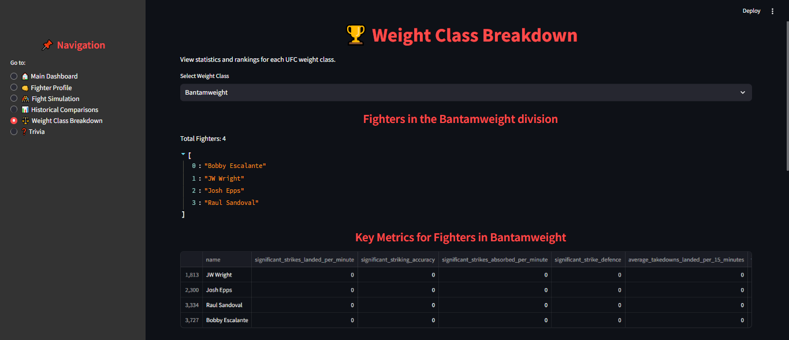
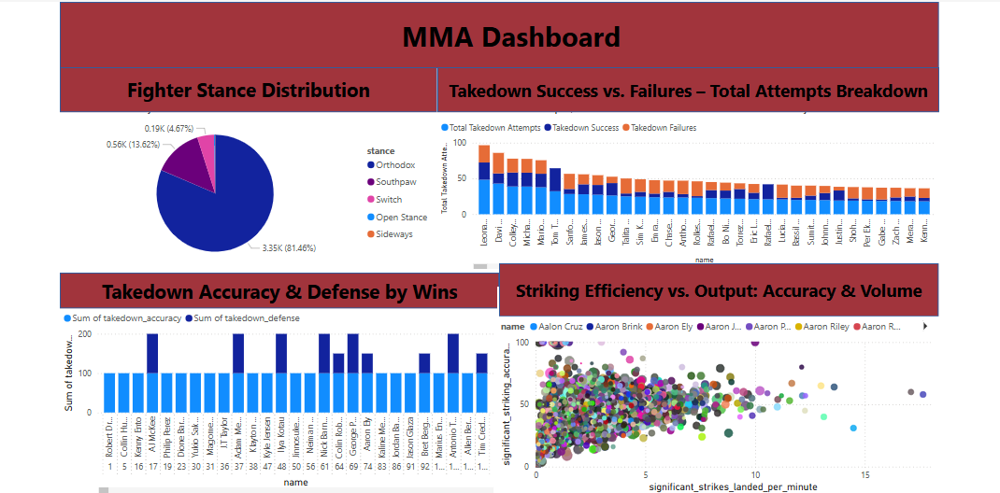

# 

## MMA Fighter Statistical Analysis

# Overview
This project explores the relationship between fighter attributes and success metrics in MMA (Mixed Martial Arts). By analyzing key performance indicators such as striking accuracy, takedown defense, and physical attributes, we aim to uncover what differentiates elite fighters from the rest.

Through statistical analysis and data visualization, this project provides insights into which factors contribute to a fighter's success.

# Objectives
* Identify performance indicators that correlate with higher win percentages.

* Analyze striking vs. grappling efficiency and their impact on fight outcomes.

* Determine if physical attributes like reach-to-height ratio influence success.

* Visualize trends and comparisons between fighters to uncover key patterns.

# Hypotheses

We tested the following five hypotheses using statistical methods:

* Reach-to-Height Ratio – Fighters with a higher reach-to-height ratio tend to have a higher win percentage- Validation: Correlation analysis between reach-to-height ratio and win percentage.

* Strike Accuracy – Fighters with better strike accuracy have higher win percentages- Validation: Regression analysis between strike accuracy and wins.

* Weight Class Impact – Heavyweights may have lower win percentages than lighter fighters due to endurance factors- Validation: T-tests comparing win percentages across weight classes.

* Takedown Defense – Fighters with better takedown defense tend to win more fights- Validation: Win percentages of fighters with high vs. low takedown defense.

* Strikes Absorbed – Fighters who absorb fewer strikes per minute have a higher win rate- Negative correlation analysis between strikes absorbed per minute and win percentage.

# Business Requirements

The goal is to uncover data-driven insights that can be applied to fighter training, strategy development, and talent scouting. Specifically, we aim to:

* Identify performance indicators that correlate with higher win percentages.

* Compare striking efficiency vs. grappling efficiency.

* Determine if physical attributes (such as reach-to-height ratio) influence success.

* Develop an interactive tool to visualize fighter comparisons dynamically.

# Analysis Techniques Used
* Exploratory Data Analysis (EDA): Histograms, scatter plots, box plots, and heatmaps were used to understand distributions and correlations.

* Statistical Testing: T-tests and regression models were applied to test hypotheses and confirm statistical significance.

* Comparative Analysis: Fighters were categorized into groups (e.g., high vs. low strike accuracy) to compare performance differences.

* Interactive Visualization: Power BI and Streamlit dashboards allow for dynamic exploration of fighter statistics.

# Dataset & Data Preparation

We used a dataset of MMA fighters that includes key statistics such as:

* Physical Attributes: Height, reach, weight class.

* Striking Stats: Significant strikes landed per minute, striking accuracy, strikes absorbed per minute.

* Grappling Stats: Takedown accuracy, takedown defense, submission attempts.

* Win/Loss Records: Total fights, wins, losses, and win percentages.
Dataset obtained from kaggle. https://www.kaggle.com/datasets/asaniczka/ufc-fighters-statistics

# Data Management Approach

* Collection & Cleaning: The dataset was preprocessed by handling missing values, standardizing numerical data, and calculating new features (e.g., reach-to-height ratio).

* Processing & Analysis: Statistical methods and data visualizations were applied to test hypotheses and identify trends.

* Interpretation & Insights: Findings were compiled into reports, dashboards, and an interactive Streamlit application.

# Data Cleaning & Preparation

Data preparation involved:

* Handling missing values and inconsistencies.

* Standardizing numerical values for better comparisons.

* Creating new calculated fields, such as reach-to-height ratio.

* Filtering data to focus on fighters with sufficient fight history.

# Data Visualization & Analysis

Our analysis was conducted in Jupyter Notebooks, focusing on:

* Comparing Fighter Attributes – Box plots and histograms to compare reach, height, and weight class distributions.

* Performance Trends – Scatter plots and regression analysis to examine correlations.

* Striking vs. Grappling Efficiency – Bar charts and heatmaps to compare successful vs. unsuccessful attempts.

* Statistical Testing – Using T-tests to validate hypotheses.

# Dashboard Visualisation

https://app.powerbi.com/links/MsQVbW9XWA?ctid=c233c072-135b-431d-af59-35e05babf941&pbi_source=linkShare&bookmarkGuid=32bdf803-529d-40ff-930e-880e220787f2

Use of AI : ChatGPT was used for brainstorming ideas and fixing code

# Key Findings & Conclusions

* Fighters with a higher reach-to-height ratio showed a slight advantage in striking success, but the correlation was weak.

* Striking accuracy had a strong positive correlation with win percentage, highlighting the importance of precision.

* Heavyweights had negative results, with a clear trend suggesting a disadvantage compared to lighter fighters which could be due many factors such as endurance, mass and skill.

* Takedown defense played a significant role in win rates, as fighters who could keep fights standing generally performed better.

* Strikes absorbed per minute was a crucial factor—fighters who took less damage had significantly higher win rates.

# Limitations & Alternative Approaches

* Data Gaps: Some fighter records were incomplete, requiring imputation or exclusion.

* Weight Class Differences: Heavyweights fight differently than lighter fighters, making direct comparisons challenging.

* Future Alternative: Incorporate real-time fight data or machine learning models for better predictions.

# Ethical Considerations

* Data Bias: The dataset may overrepresent certain weight classes or fighting styles. To mitigate this, we ensured balanced comparisons across divisions.

* Fairness: Statistical tests were used to confirm objective analysis, minimizing subjective bias.

* Privacy & Compliance: All data was sourced from publicly available fight statistics, ensuring ethical data usage.

# Unfixed Bugs & Challenges Faced

* Missing Data for Some Fighters: Some fighters had incomplete records, affecting certain analyses.

* Feature Engineering Limitations: Some metrics (like fight pace) are difficult to quantify with available data.

* Dashboard Performance: High interactivity in Power BI and Streamlit required optimizations for faster load times.

# Knowledge Gaps & How They Were Addressed

* Advanced Statistical Analysis: Researched additional regression models to refine findings.

* Data Visualization Best Practices: Studied effective dashboard designs to enhance clarity.

* Technical Feedback: Incorporated feedback from data science peers to improve model interpretations.

# Developmental Roadmap and Future Improvements

* Challenges & Strategies Used

* Complex Data Relationships: Addressed using correlation matrices and statistical testing.
* Interactivity vs. Performance: Streamlined Power BI and Streamlit dashboards for better efficiency.

* Future Enhancements

* Expand the dataset to include more fighters and historical fight data for deeper analysis.
* Incorporate machine learning models to predict fight outcomes based on fighter statistics.
* Opponent-Based Insights: Analyze head-to-head matchups to determine which styles work best against different fighter archetypes.
* Automate Data Updates: Create a pipeline to pull updated fight statistics automatically for continuous analysis.

# Tools & Technologies Used

* Jupyter Notebook for data analysis and visualization.

* Python (Pandas, NumPy, Matplotlib, Seaborn, SciPy) for data manipulation, visualization, and statistical analysis.

* Power BI (Future Enhancement) for interactive reporting.

* Streamlit for building interactive web applications.

# Acknowledgments

I would like to thank and praise everyone at Code Institute especially the Data Analytics group who I have closely worked with over the past few months